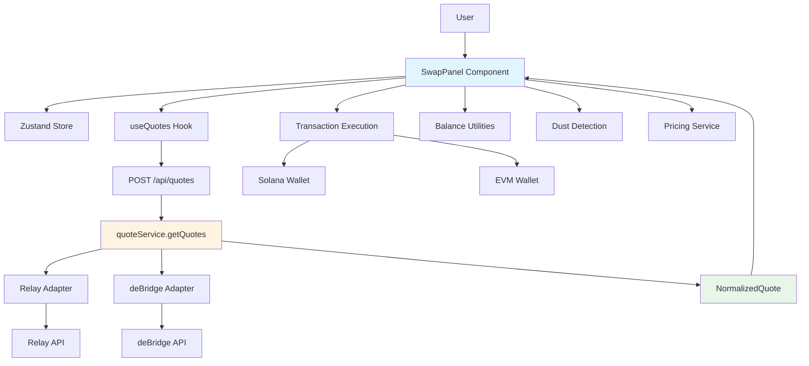
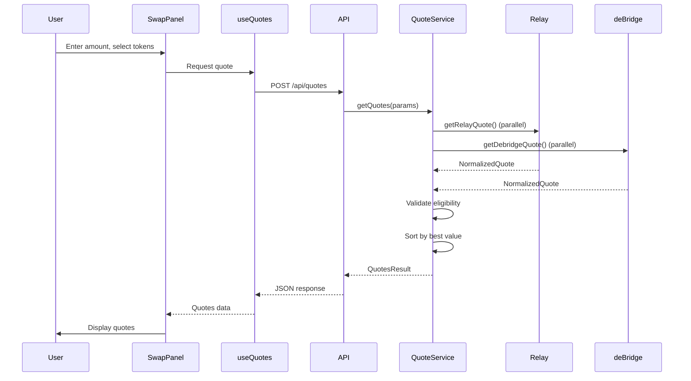
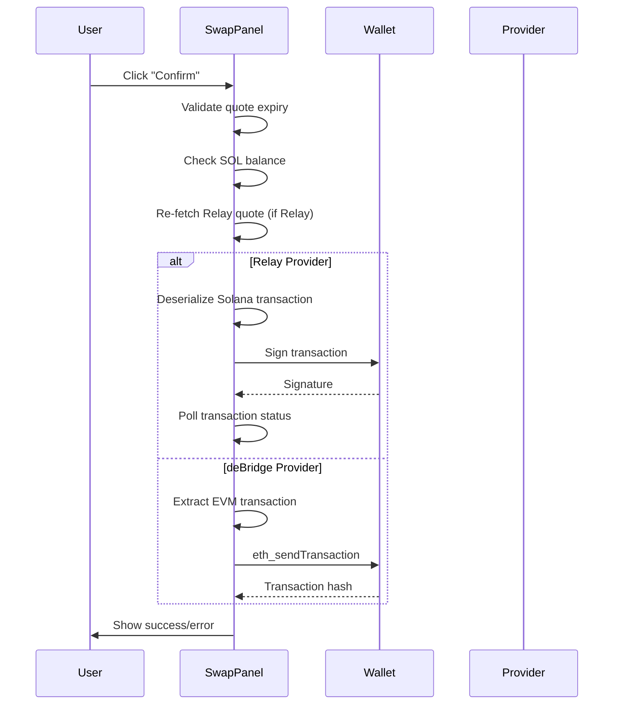

# Architecture Documentation

## System Overview

Multi-Chain Swap is a bridge-agnostic, fully off-chain cross-chain swap system that supports multiple bridge providers (Relay and deBridge). The system enables users to swap tokens across different blockchains (Solana, Ethereum, Base, Optimism, Arbitrum, BNB, Polygon, Avalanche) with a unified interface.

### Key Features

- **Bridge-Agnostic Design**: Normalized interface supporting multiple providers
- **Economic Guarantees**: User pays fees in USDC or SOL; Solana-side costs can be sponsored (requires Enterprise Partnership with Relay)
- **Provider Selection**: Automatically selects best quote from available providers
- **Token Support**: SPL tokens and Token-2022 (including transfer fees)
- **Safety Features**: Dust detection, uncloseable account warnings, price drift protection
- **Fully Off-Chain**: No Solana programs or smart contracts required

## Architecture Diagram

## Component Structure

### Frontend Layer (`src/app/`, `src/components/`)

#### Next.js App Router (`src/app/`)
- **`page.tsx`**: Root page component
- **`layout.tsx`**: Root layout with providers
- **`HomePageClient.tsx`**: Client-side entry point
- **`api/quotes/route.ts`**: API endpoint for quote fetching

#### React Components (`src/components/`)

**Swap Components** (`src/components/swap/`):
- **`SwapPanel.tsx`**: Main swap interface component
  - Handles user input (amount, token selection)
  - Manages quote fetching and display
  - Executes transactions (Solana/EVM)
  - Shows balance, fees, and warnings
- **`TokenSelect.tsx`**: Token selection dropdown
- **`DestinationSelector.tsx`**: Combined chain + token selector for destination
- **`SelectDropdown.tsx`**: Reusable dropdown component

**Wallet Components** (`src/components/wallet/`):
- **`WalletConnectButton.tsx`**: Wallet connection button
- **`WalletErrorBanner.tsx`**: Error display for wallet issues

**Providers** (`src/components/providers/`):
- **`SolanaWalletProvider.tsx`**: Solana wallet adapter provider
- **`ClientProviders.tsx`**: Wraps all client-side providers

### State Management (`src/stores/`)

**`swapStore.ts`** (Zustand):
- Form state (origin token, amount, destination chain/token)
- Balance state (SOL, source token balances)
- Quote state (selected quote, params, timestamps)
- Execution state (executing, errors, success messages)
- Price state (SOL and token prices)
- UI state (EVM address fetching, errors)

### API Layer (`src/app/api/`)

**`quotes/route.ts`**:
- Validates request parameters
- Calls `quoteService.getQuotes()`
- Returns normalized quotes or error responses
- Handles `NeedSolForGasError` and other error types

**`swaps/history/route.ts`**:
- Fetches swap history for a user with pagination and filtering
- Supports filtering by status and provider
- Returns paginated list of swap transactions

**`swaps/[id]/route.ts`**:
- Fetches details for a specific swap transaction by ID
- Returns single swap transaction or 404 if not found

### Service Layer (`src/lib/`)

#### Quote Service (`src/lib/swap/`)

**`quoteService.ts`**:
- Fetches quotes from Relay and deBridge in parallel
- Validates quote eligibility (sponsor profitability, route logic)
- Sorts quotes by best value (net USD, effective receive)
- Applies tie-breaker logic (prefer Relay when within 0.1% of deBridge)
- Handles errors gracefully

**Key Functions**:
- `getQuotes()`: Main entry point for quote fetching
- `validateSponsorProfitability()`: Ensures sponsor never has net loss
- `checkEligibility()`: Validates quote meets requirements
- `sortByBest()`: Sorts quotes by user value
- `effectiveReceiveRaw()`: Calculates net receive amount

#### Provider Adapters

**Relay Adapter** (`src/lib/relay/quote.ts`):
- Fetches quotes from Relay API
- Normalizes Relay response to `NormalizedQuote`
- Calculates worst-case sponsor costs (gas, rent, token loss, price drift)
- Handles Token-2022 detection and transfer fees
- Supports fee sponsorship (requires Enterprise Partnership)

**deBridge Adapter** (`src/lib/debridge/quote.ts`):
- Fetches quotes from deBridge DLN API
- Normalizes deBridge response to `NormalizedQuote`
- Handles operating expenses
- Supports EVM and Solana destinations

#### Utilities

**Solana Utilities** (`src/lib/solana/`):
- **`balance.ts`**: Balance fetching, dust detection
- **`tokenDetection.ts`**: Token-2022 detection
- **`transactionStatus.ts`**: Transaction status polling
- **`dustDetection.ts`**: Dust threshold calculations

**Pricing** (`src/lib/pricing/`):
- **`solPrice.ts`**: SOL price fetching (CoinGecko)
- **`tokenPrice.ts`**: Token price fetching (CoinGecko)

**Chain Configuration** (`src/lib/chainConfig.ts`):
- Chain ID mappings (Relay vs deBridge)
- Token lists by chain
- Chain name utilities

**Formatting** (`src/lib/utils/formatting.ts`):
- Raw amount to human-readable conversion
- Decimal handling

### Hooks (`src/hooks/`)

- **`useQuotes.ts`**: React Query hook for quote fetching
- **`useSupportedTokens.ts`**: React Query hook for token lists
- **`useWalletLifecycle.ts`**: Wallet connection lifecycle management

### Types (`src/types/`)

**`swap.ts`**:
- `SwapParams`: Request parameters
- `NormalizedQuote`: Provider-agnostic quote format
- `QuotesResult`: Quote fetching result
- UI component types (`DropdownOption`, `TokenOption`)

## Data Flow

### Quote Fetching Flow

### Transaction Execution Flow

## Key Design Decisions

### 1. Provider-Agnostic Normalization Layer

All provider-specific responses are normalized to a common `NormalizedQuote` format. This allows:
- Easy addition of new providers
- Consistent UI regardless of provider
- Unified quote comparison logic

### 2. Sponsor Profitability Validation

Every Relay quote is validated to ensure the sponsor never has a net loss:
- Calculates worst-case costs (gas, rent, token loss, price drift)
- Ensures user fee covers costs with 20% margin
- Blocks execution if validation fails

### 3. Price Drift Protection

A 2% price drift buffer is included in worst-case cost calculations to account for:
- Market volatility between quote and execution
- Slippage in DEX swaps
- Price movements during transaction confirmation

### 4. Dust Detection and Warnings

Before execution, the system checks if the swap would leave:
- Dust amounts (below rent-exempt minimum)
- Uncloseable accounts (exactly at rent-exempt minimum)

Users are warned but not blocked from executing.

### 5. Quote Expiry Handling

- Quotes expire after 15 seconds
- Background expiry check (no auto-refresh)
- User prompted to refetch when expired
- Relay quotes re-fetched before execution for safety

### 6. Parallel Provider Fetching

Quotes from Relay and deBridge are fetched in parallel using `Promise.allSettled()`:
- Faster response times
- Graceful degradation if one provider fails
- Best quote automatically selected

### 7. Balance Optimization

Optional balance parameters (`userSOLBalance`, `userSolanaUSDCBalance`) allow:
- Client-side balance checks to avoid RPC calls
- Faster quote fetching
- Reduced server load

## Security Considerations

### Sponsor Fund Safety

Multiple layers ensure sponsor funds are never lost:
1. **Pre-execution validation**: `validateSponsorProfitability()` checks every quote
2. **Worst-case cost calculation**: Includes all possible costs with buffers
3. **Price drift protection**: 2% buffer accounts for volatility
4. **Re-validation**: Relay quotes re-fetched and validated before execution
5. **Balance checks**: Ensures user has sufficient funds before execution

### User Fund Safety

- Dust warnings prevent accidental fund loss
- Uncloseable account warnings prevent account lockup
- Quote expiry prevents stale quotes
- Balance validation before execution

### Environment Variables

- `NEXT_PUBLIC_*` variables are exposed to client (use carefully)
- Server-only variables (no prefix) are safe
- Never commit `.env.local` or `.env` files

## Performance Optimizations

- **Quote caching**: React Query caches quotes for 30 seconds
- **Parallel fetching**: Relay and deBridge fetched simultaneously
- **Debouncing**: Quote requests debounced (600ms) to reduce API calls
- **Balance optimization**: Optional balance parameters reduce RPC calls
- **Price caching**: SOL and token prices cached for 1 minute

## Testing Strategy

- **Unit tests**: Core logic (quote service, balance checks, token detection)
- **Component tests**: UI components with React Testing Library
- **E2E tests**: Playwright tests for full user flows
- **Integration tests**: API endpoint tests

## Future Enhancements

- Additional bridge providers
- Transaction history persistent storage (currently in-memory; Prisma integration planned)
- Advanced routing (multi-hop swaps)
- Slippage tolerance configuration
- Gas price optimization
